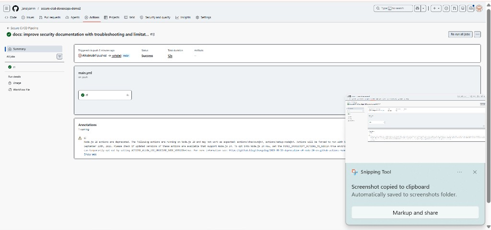
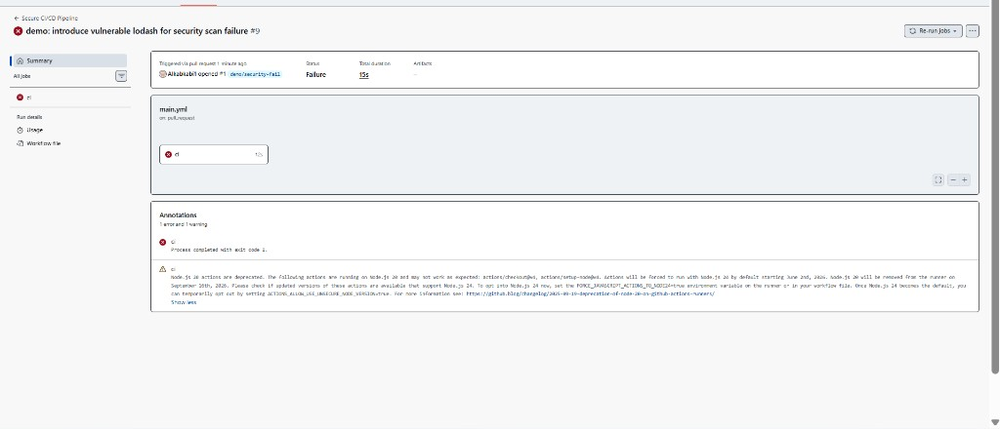
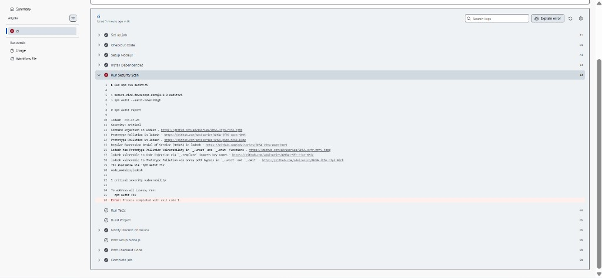

# secure-cicd-devsecops-demo2

DevSecOps CI/CD demo: automated dependency security scanning in GitHub Actions.

## Security scan

The pipeline runs `npm run audit:ci` after `npm install`. If that step fails, later jobs in the workflow do not run (tests, build, etc.). See [docs/SECURITY.md](docs/SECURITY.md) for severity levels, setup issues we ran into, and how to reproduce pass/fail locally.

## Pipeline screenshots

### Success scenario (`main`)

Push to `main` with safe dependencies — pipeline passes, including the security scan.

### Failure scenario (`demo/security-fail` → PR to `main`)

Pull request with vulnerable `lodash@4.17.11` — workflow fails and blocks later stages.

The failure run shows **Run Tests** and **Build Project** skipped after the security gate fails (fail closed).

## Person 4 — Discord setup

1. In Discord: channel **Integrations** → **Webhooks** → **New webhook** → copy the webhook URL.
2. In GitHub: repo **Settings** → **Secrets and variables** → **Actions** → **New repository secret**.
3. Name: `DISCORD_WEBHOOK_URL`, value: the webhook URL from step 1.
4. Test: re-run a failed workflow on the `demo/security-fail` PR; you should see an alert when any step fails.

If the secret is not set, the pipeline still fails on security issues; the Discord step logs a skip message and does not block the failure signal.
