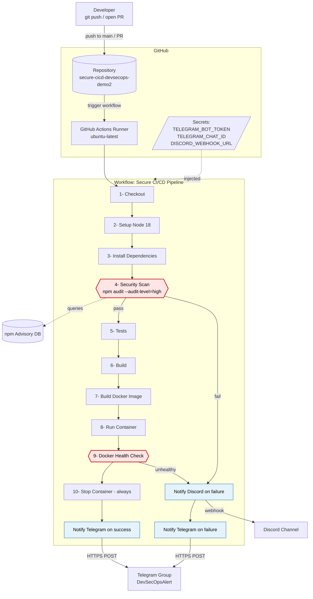
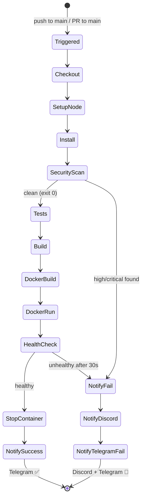
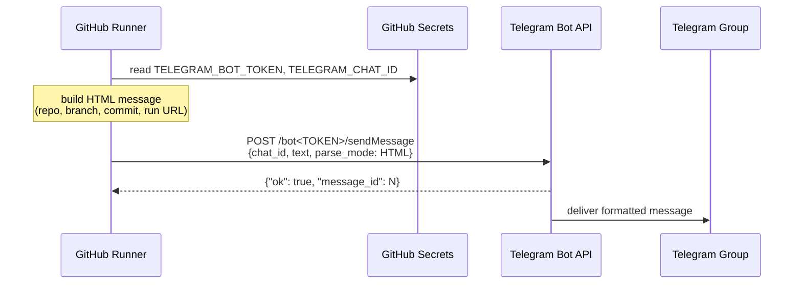
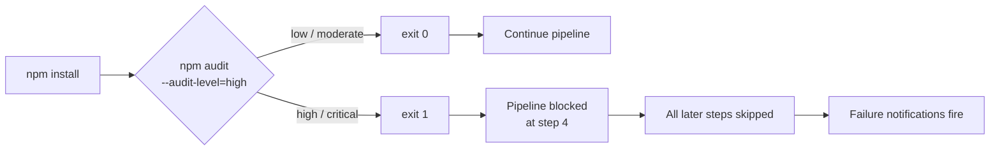
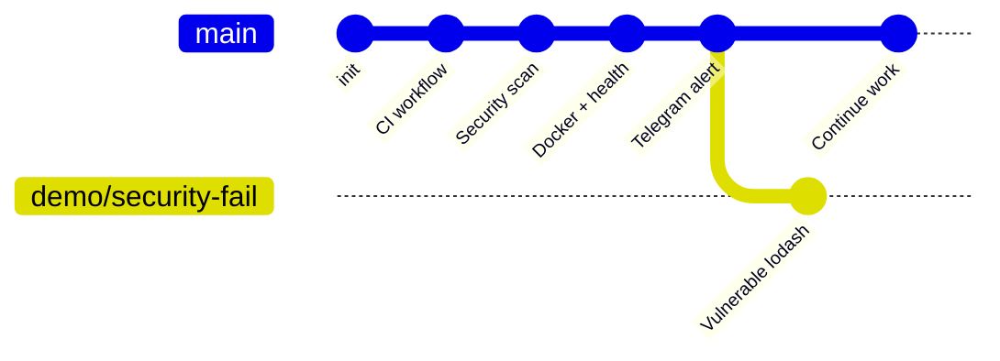

# Architecture — Secure CI/CD Pipeline with DevSecOps

> هذا المستند يصف المعمارية الكاملة للبايبلاين، بما في ذلك المكونات، تدفق البيانات، نقاط الفشل، وقنوات التنبيه.

---

## 1. Big Picture Diagram



---

## 2. Component Breakdown

| المكوّن | الدور | المسؤول (في الفريق) |
|---|---|---|
| GitHub Repository | مصدر الكود ومحفّز البايبلاين | الشخص 1 |
| GitHub Actions Workflow | تنفيذ خطوات CI/CD | الشخص 1 |
| `npm audit` | فحص الثغرات في الاعتماديات | الشخص 2 |
| Dockerfile + HEALTHCHECK | حاوية + مراقبة صحة | الشخص 3 |
| Discord Webhook | قناة تنبيه احتياطية | الشخص 4 |
| Telegram Bot + Group | قناة التنبيه الرئيسية (نجاح + فشل) | الشخص 4 |
| GitHub Secrets | تخزين آمن للتوكنات | الشخص 4 |

---

## 3. Pipeline State Machine



---

## 4. Data Flow — رسالة التنبيه



---

## 5. Security Gate Logic



---

## 6. Branch Strategy



- **`main`** — اعتماديات آمنة. push عليه = pipeline يمر = Telegram success.
- **`demo/security-fail`** — يستخدم `lodash@^4.17.11` (ثغرة معروفة). PR منه إلى main = pipeline يفشل عند Security Scan = Telegram + Discord failure alerts.

---

## 7. Files Map

```
secure-cicd-devsecops-demo2/
│
├── .github/workflows/main.yml   ← orchestration (الشخص 1)
├── package.json                 ← deps + audit:ci (الشخص 2)
├── Dockerfile                   ← container + HEALTHCHECK (الشخص 3)
├── server.js                    ← /health endpoint (الشخص 3)
│
└── docs/
    ├── SECURITY.md              ← security gate explanation (الشخص 2)
    ├── ARCHITECTURE.md          ← this file (الشخص 4)
    ├── DEMO_FLOW_AR.md          ← presentation script (الشخص 4)
    ├── CHALLENGES_AR.md         ← issues & fixes (الشخص 4)
    ├── PRESENTATION_AR.md       ← slides content (الشخص 4)
    ├── PROJECT_OVERVIEW_AR.md   ← Arabic project overview
    └── screenshots/             ← evidence of pass/fail runs
```
