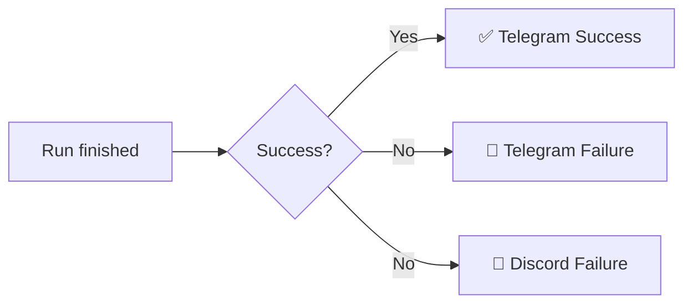

<!-- _class: lead -->

# 🛡 Secure CI/CD Pipeline
## with DevSecOps, Docker & Multi-Channel Alerts

**Team Project — Final Presentation**

`janalyamm/secure-cicd-devsecops-demo2`

---

# 📋 Agenda

1. **Why DevSecOps?** — لماذا الأمان داخل CI/CD
2. **Architecture** — معمارية الحل
3. **Pipeline Walkthrough** — جولة في الـ workflow
4. **Live Demo** — سيناريو نجاح + فشل
5. **Alerting** — Telegram + Discord
6. **Challenges & Lessons** — ما تعلّمناه
7. **Q&A**

---

# 🎯 The Problem

> "نحن نكتب الكود بسرعة، لكن الـ dependencies التي نستخدمها قد تحتوي ثغرات يكتشفها المهاجم قبل ما نكتشفها نحن."

**التقليدي:** فحص الأمان قبل الإطلاق فقط → الثغرة تصل للإنتاج.

**DevSecOps:** فحص في كل push/PR → الثغرة تُمنع قبل الـ merge.

---

# 💡 DevSecOps in One Slide

| التقليدي (DevOps) | الجديد (DevSecOps) |
|---|---|
| Build → Test → Deploy | Build → **Scan** → Test → **Verify** → Deploy |
| Security check قبل الإطلاق فقط | Security check في كل push |
| فريق Security منفصل | Security جزء من الـ pipeline |
| Reactive | **Proactive / Shift-Left** |

---

# 🏛 Architecture

```
Developer → GitHub → Workflow
                       ↓
              [11 steps in order]
                       ↓
        ┌──────────────┴──────────────┐
        ↓                              ↓
   Pipeline Success            Pipeline Failure
        ↓                              ↓
   ✅ Telegram                  🚨 Telegram
                                🚨 Discord
```

تفاصيل كاملة في [`docs/ARCHITECTURE.md`](ARCHITECTURE.md).

---

# 🧩 Pipeline Steps

| # | Step | Tool | الدور |
|---|---|---|---|
| 1 | Checkout | actions/checkout@v4 | جلب الكود |
| 2 | Setup Node | actions/setup-node@v4 | بيئة Node 18 |
| 3 | Install | `npm install` | الاعتماديات |
| **4** | **Security Scan** | `npm audit` | 🛡 **بوّابة الأمان** |
| 5 | Tests | `npm test` | اختبارات |
| 6 | Build | `npm run build` | بناء |
| 7–9 | Docker + Health | docker, curl | حاوية صحية |
| 10 | Notify | Telegram/Discord | تنبيهات |

---

# 🔒 The Security Gate

```yaml
- name: Run Security Scan
  run: npm run audit:ci
  # which runs:
  # npm audit --audit-level=high
```

- يفحص شجرة الاعتماديات
- يرجع exit code != 0 لأي ثغرة `high` أو `critical`
- خطوة 4 → باقي الخطوات تُتخطّى تلقائياً

**Fail-Closed Behavior**

---

# 🐳 Docker Health Check

```dockerfile
HEALTHCHECK --interval=10s --timeout=3s --retries=3 \
  CMD curl --fail http://localhost:3000/health || exit 1
```

**فرق مهم:**
- `running` = الـ container يعمل (لا يعني شيئاً)
- `healthy` = الـ app نفسها تردّ على `/health`

---

# 📣 Notification Strategy



- **Telegram** قناة رئيسية — أسرع في تجاربنا
- **Discord** قناة احتياطية
- كل خطوة `continue-on-error: true` → فشل القناة لا يُغيّر نتيجة CI

---

# 📲 Live Telegram Alert

**عند النجاح:**
```
✅ Pipeline Success
Repo: janalyamm/secure-cicd-devsecops-demo2
Branch: main
Commit: a2613d6
All steps passed: security scan, tests, build,
and Docker health check.
View workflow run
```

**عند الفشل:**
```
🚨 Pipeline Failure
Branch: demo/security-fail
Cause: a CI step failed (often: npm audit found
high/critical vulnerability).
View workflow run
```

---

# 🎬 Demo Plan

### ✅ Scenario A — Success
1. Push على `main` (lodash آمن)
2. Pipeline يمر → Telegram success

### ❌ Scenario B — Failure
1. PR من `demo/security-fail` (`lodash@4.17.11`)
2. خطوة Security Scan تفشل
3. باقي الخطوات تُتخطّى
4. Telegram + Discord يستلمان alert

---

# ⚠ Challenges (1/2)

1. **lockfile مفقود** → `npm audit` كان يمر فاضي
   - الحل: commit `package-lock.json`

2. **الإصدار "الآمن" تغيّر** → `lodash@4.17.21` بدأ يفشل
   - الحل: استقرّينا على `4.18.1` للـ pass و `4.17.11` للـ fail

3. **ترتيب الخطوات** → Docker قبل Security = إهدار وقت
   - الحل: Fail-fast — الأمان أولاً

---

# ⚠ Challenges (2/2)

4. **Discord delays** → بعض الرسائل تأخّرت دقائق
   - الحل: Telegram كقناة موازية

5. **Node 20 deprecation warning** → سيُجبر Node 24 في 2026-06-02
   - الحل: ترقية actions/checkout, actions/setup-node

6. **curl غير موجود في `node:slim`** → HEALTHCHECK فشل
   - الحل: `apt-get install curl` في Dockerfile

تفاصيل في [`docs/CHALLENGES_AR.md`](CHALLENGES_AR.md).

---

# 📚 Lessons Learned

- 🔐 **Shift-Left** يقلل تكلفة الثغرة (الإصلاح أرخص قبل الـ merge)
- ⚡ **Fail-Fast** — رتّب الخطوات بحسب التكلفة × الفشل
- 🔁 **Multi-Channel Alerts** — لا تعتمد على قناة واحدة
- 📦 **Lockfile is mandatory** لأي مسح أمان موثوق
- 🛠 **Warnings = Future Errors** — تابِعها مبكراً

---

# 👥 Team Contributions

| الشخص | الدور | الـ Deliverable |
|---|---|---|
| 1 | GitHub Actions Owner | workflow + CI |
| 2 | DevSecOps Engineer | npm audit + severity policy |
| 3 | Docker Engineer | Dockerfile + HEALTHCHECK |
| **4** | **Notifications & Demo** | **Telegram, Discord, Slides, Architecture** |

---

# 🔗 Project Links

- **Repo:** github.com/janalyamm/secure-cicd-devsecops-demo2
- **Failing PR:** PR #1 (demo/security-fail → main)
- **Workflow:** `.github/workflows/main.yml`
- **Docs:**
  - [SECURITY.md](SECURITY.md)
  - [ARCHITECTURE.md](ARCHITECTURE.md)
  - [DEMO_FLOW_AR.md](DEMO_FLOW_AR.md)
  - [CHALLENGES_AR.md](CHALLENGES_AR.md)

---

<!-- _class: lead -->

# 🙏 Q&A

**شكراً لاستماعكم**

> الأسئلة المتوقّعة وردودها الجاهزة في
> [`docs/DEMO_FLOW_AR.md`](DEMO_FLOW_AR.md) — قسم 11.
